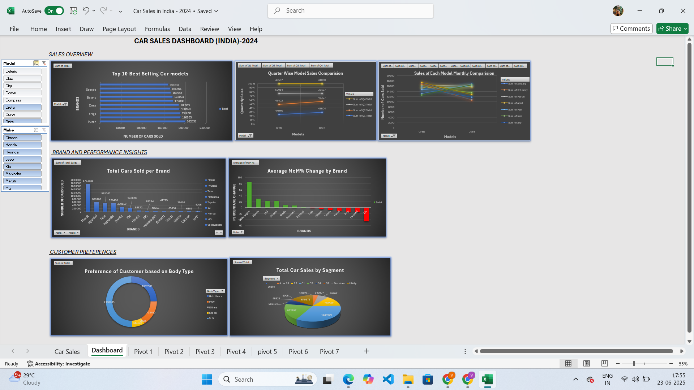

# 🚗 Car Sales Dashboard – Excel Mini Project

This project is a beginner-friendly Excel dashboard that analyzes and visualizes car sales data across different models, brands, body types, and time periods. It leverages Excel's built-in tools like PivotTables, charts, slicers, and conditional formatting to create an interactive and insightful report.

---

## 📊 Dashboard Overview

The dashboard includes:
- **Total cars sold per brand & model**
- **Monthly & quarterly comparisons**
- **MoM% (Month-over-Month) growth**
- **Body type and segment preferences**
- **Interactive filters (Make, Model, Segment)**

All visuals are dynamically connected using slicers and PivotTables.

---

## 📁 File Structure

| Sheet Name     | Description                                  |
|----------------|----------------------------------------------|
| `Car Sales`     | Raw dataset with columns like Make, Model, Sales, MoM% |
| `Dashboard`     | Interactive dashboard with charts and slicers |

---

## 🛠️ Tools Used

- Microsoft Excel
  - PivotTables
  - PivotCharts
  - Slicers
  - Conditional Formatting
  - Data cleaning & formulas

---

## 🧠 What I Learned

- How to build a complete dashboard from raw Excel data
- Analyzing time-based performance metrics like MoM%
- Structuring data for better visual storytelling
- Designing clean, readable visualizations

---

## 📷 Screenshot

---

## ✅ How to Use

1. Open the `.xlsx` file in Excel (desktop version recommended).
2. Use the slicers to filter by Make, Model, or Segment.
3. Explore dynamic charts and performance trends.
4. View raw data in the `Car Sales` sheet.

---

## 📎 Dataset Info

[From kaggle](https://www.kaggle.com/datasets/sourd810/car-sales-india-2024)

---

## 📬 Connect with Me

If you're a recruiter, peer, or mentor — feel free to reach out or give feedback!

- **LinkedIn**: [https://www.linkedin.com/in/vaishnavi-sinha-v2005/]
- **GitHub**: [https://github.com/Vaishnavi-020]

---

**#Excel #Dashboard #DataAnalytics #CarSales #MiniProject #LearningByDoing**

